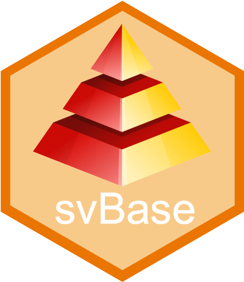

<!-- README.md is generated from README.Rmd. Please edit that file -->

```{r, include=FALSE}
knitr::opts_chunk$set(collapse = TRUE, comment = "#>",
  fig.path = "man/figures/README-", out.width = "100%")
```

# 'SciViews::R' - Base Functions <a href="https://www.sciviews.org/svBase"></a>

<!-- badges: start -->
[](https://github.com/SciViews/svBase/actions/workflows/R-CMD-check.yaml)
[](https://codecov.io/gh/SciViews/svBase)
[](https://cran.r-project.org/package=svBase)
[](https://sciviews.r-universe.dev/svBase)
[](https://opensource.org/licenses/MIT)
[](https://lifecycle.r-lib.org/articles/stages.html#stable)
<!-- badges: end -->

{svBase} sets up the way data frames (with objects like R base's **data.frame**, **data.table** and tibble **tbl_df**) are managed in SciViews. The user can select the class of object it uses by default and many other SciViews functions return that format. Also conversion from one to the other is smoothed, including for the management of **data.frame**'s row names or **data.table**'s keys. Also homogeneous ways to create a data frame or to print it are also provided.

## Installation

{svBase} is not available from CRAN yet. You should install it from the [SciViews R-Universe](https://sciviews.r-universe.dev). To install this package and its dependencies, run the following command in R:

```{r, eval=FALSE}
install.packages('svBase', repos = c('https://sciviews.r-universe.dev',
  'https://cloud.r-project.org'))
```

You can also install the latest development version. Make sure you have the {remotes} R package installed:

``` r
install.packages("remotes")
```

Use `install_github()` to install the {svBase} package from GitHub (source from **main** branch will be recompiled on your machine):

``` r
remotes::install_github("SciViews/svBase")
```

R should install all required dependencies automatically, and then it should compile and install {svBase}.

## Further explore {svBase}

You can get further help about this package this way: Make the {svBase} package available in your R session:

``` r
library("svBase")
```

Get help about this package:

``` r
library(help = "svBase")
help("svBase-package")
vignette("svBase") # None is installed with install_github()
```

For further instructions, please, refer to the help pages at <https://www.sciviews.org/svBase/>.

## Code of Conduct

Please note that the {svBase} package is released with a [Contributor Code of Conduct](https://contributor-covenant.org/version/2/1/CODE_OF_CONDUCT.html). By contributing to this project, you agree to abide by its terms.
